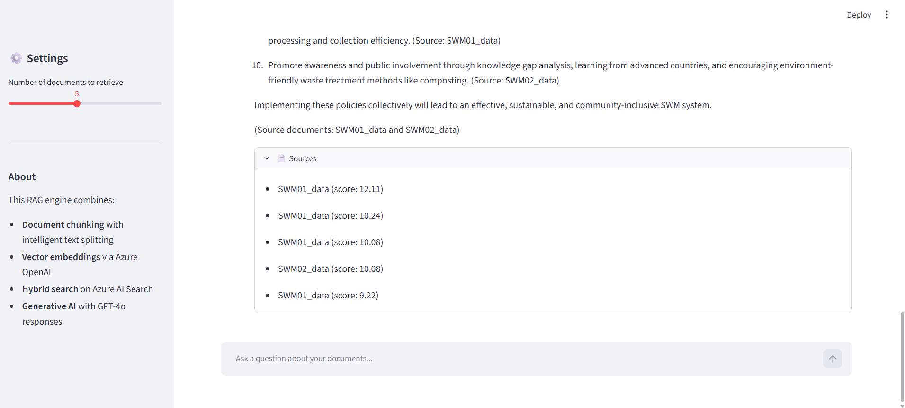

# Azure Cognitive RAG Engine

A production-ready Retrieval-Augmented Generation (RAG) system that integrates Azure Cognitive Services with OpenAI's GPT-4 to build an intelligent document search and question-answering chatbot.

## 🏗️ Complete Data Flow Architecture

### End-to-End Pipeline

```
┌─────────────────────────────────────────────────────────────────────────────┐
│                        USER QUERY INPUT (Streamlit UI)                      │
│                              "SWM means?"                                    │
└───────────────────────────────┬─────────────────────────────────────────────┘
                                │
                                ▼
┌─────────────────────────────────────────────────────────────────────────────┐
│  STEP 1: EMBEDDING GENERATION (embedding.py)                               │
│  ├─ Query: "SWM means?"                                                     │
│  ├─ Azure OpenAI (text-embedding-3-large)                                  │
│  ├─ Output: Vector [0.123, -0.456, 0.789, ...] (3072 dimensions)           │
│  └─ Connection: AZURE_OPENAI_ENDPOINT + AZURE_OPENAI_API_KEY               │
└───────────────────────────────┬─────────────────────────────────────────────┘
                                │
                                ▼
┌─────────────────────────────────────────────────────────────────────────────┐
│  STEP 2: HYBRID SEARCH (indexing.py + Azure AI Search)                     │
│  ├─ Vector Search: Find semantically similar chunks                        │
│  │  └─ Query vector vs. stored chunk vectors (content_vector field)        │
│  │                                                                           │
│  ├─ Full-Text Search: Find keyword matches                                 │
│  │  └─ "SWM" keyword search in content field                               │
│  │                                                                           │
│  ├─ Hybrid Merge: Combine and deduplicate results                          │
│  ├─ Top K Results: Return 5 most relevant chunks                           │
│  └─ Connection: AZURE_SEARCH_ENDPOINT + AZURE_SEARCH_API_KEY               │
│     Index: abhiindex                                                        │
└───────────────────────────────┬─────────────────────────────────────────────┘
                                │
                    ┌───────────┴───────────┐
                    │                       │
        Result 1: SWM01_data Chunk 15       Result 2: SWM02_data Chunk 8
        "SWM stands for Solid Waste..."    "SWM includes waste segreg..."
        Score: 3.79                        Score: 1.43
                    │                       │
                    └───────────┬───────────┘
                                ▼
┌─────────────────────────────────────────────────────────────────────────────┐
│  STEP 3: CONTEXT ASSEMBLY (app.py)                                         │
│  ├─ Retrieve top 5 chunks from search results                              │
│  ├─ Format as context:                                                     │
│  │  [Source: SWM01_data] SWM stands for Solid Waste Management...          │
│  │  [Source: SWM02_data] SWM includes waste segregation...                 │
│  └─ Output: Formatted context string                                       │
└───────────────────────────────┬─────────────────────────────────────────────┘
                                │
                                ▼
┌─────────────────────────────────────────────────────────────────────────────┐
│  STEP 4: PROMPT CONSTRUCTION (app.py)                                      │
│  ├─ System Prompt:                                                         │
│  │  "You are a helpful assistant. Answer using only provided context..."   │
│  │                                                                           │
│  ├─ User Message:                                                          │
│  │  "Context Documents: [formatted context above]                          │
│  │   User Question: SWM means?"                                            │
│  │                                                                           │
│  └─ Output: Complete prompt ready for GPT-4                               │
└───────────────────────────────┬─────────────────────────────────────────────┘
                                │
                                ▼
┌─────────────────────────────────────────────────────────────────────────────┐
│  STEP 5: RESPONSE GENERATION (app.py + Azure OpenAI)                       │
│  ├─ Model: gpt-4.1-mini (deployment: gpt-4.1-mini)                        │
│  ├─ Temperature: 0.7 (balanced creativity)                                 │
│  ├─ Max Tokens: 1000                                                       │
│  ├─ Process:                                                               │
│  │  1. Send prompt + context to Azure OpenAI                               │
│  │  2. GPT-4 generates response using context                              │
│  │  3. Response cites source documents                                     │
│  └─ Connection: AZURE_OPENAI_ENDPOINT + AZURE_OPENAI_API_KEY              │
│     API Version: 2024-08-01-preview                                        │
└───────────────────────────────┬─────────────────────────────────────────────┘
                                │
                                ▼
┌─────────────────────────────────────────────────────────────────────────────┐
│                      FINAL OUTPUT TO USER                                   │
│                                                                              │
│  Answer: "SWM stands for Solid Waste Management, as indicated by the       │
│           context in the documents discussing various aspects of           │
│           managing municipal solid waste, waste segregation, processing,   │
│           and disposal (e.g., Manual on Municipal Solid Waste..."          │
│                                                                              │
│  Sources:                                                                   │
│  • SWM01_data (score: 3.79)                                                │
│  • SWM01_data (score: 3.79)                                                │
│  • SWM02_data (score: 1.43)                                                │
│  • SWM02_data (score: 1.40)                                                │
│  • SWM02_data (score: 1.37)                                                │
└─────────────────────────────────────────────────────────────────────────────┘
```

---

## 📊 Detailed Component Breakdown

### 1. **Indexing Pipeline** (`index_documents.py`)
Runs once to load all PDFs into Azure AI Search.

```
PDF Files (data/sample_documents/)
│
├─ SWM01_data.pdf (158,189 characters)
└─ SWM02_data.pdf (89,605 characters)
    │
    ▼
[chunking.py] - DocumentChunker.process_pdf_directory()
│
├─ Extract text from PDFs using PyPDF
├─ Split into chunks:
│  ├─ Max chunk size: 2000 characters
│  ├─ Overlap: 200 characters (for context continuity)
│  ├─ Total chunks created: 139
│  │  ├─ SWM01_data: 89 chunks
│  │  └─ SWM02_data: 50 chunks
│
▼
[embedding.py] - EmbeddingClient.embed_batch()
│
├─ Batch process 139 chunks (10 chunks per batch)
├─ Call Azure OpenAI text-embedding-3-large
├─ Generate 3072-dimensional vectors for each chunk
│
▼
[indexing.py] - SearchIndexer.index_documents()
│
├─ Prepare documents with structure:
│  {
│    "id": "SWM01_data_chunk_0",
│    "document_id": "SWM01_data",
│    "chunk_index": 0,
│    "content": "Chunk text content...",
│    "content_vector": [0.123, -0.456, ...],  # 3072 dims
│    "character_count": 1856
│  }
│
└─ Upload to Azure AI Search Index (abhiindex)
   └─ Total indexed: 139 documents
```

### 2. **Azure AI Search Index Schema**

```
Index Name: abhiindex
├─ id (String, key=True)
│  └─ Unique identifier for each chunk
│
├─ document_id (String, searchable, filterable)
│  └─ Source PDF filename (SWM01_data, SWM02_data)
│
├─ chunk_index (Int32, filterable)
│  └─ Position of chunk within document
│
├─ content (String, searchable)
│  └─ Actual chunk text - used for full-text search
│
├─ content_vector (Collection<Single>, vector search profile)
│  └─ 3072-dimensional embedding vector
│  └─ Used for semantic/vector search
│  └─ Algorithm: HNSW (Hierarchical Navigable Small Worlds)
│
└─ character_count (Int32, filterable)
   └─ Size of chunk for ranking
```

### 3. **Runtime Query Pipeline** (`app.py`)

```
User Types: "what doc is about"
    │
    ▼
[RAGChatbot.chat()]
│
├─ RETRIEVE PHASE
│  │
│  ├─[1] embedding_client.embed_text(query)
│  │   └─ Convert query to 3072-dim vector
│  │
│  └─[2] search_indexer.hybrid_search()
│     │
│     ├─ VECTOR SEARCH
│     │  └─ VectorizedQuery(vector=embedding, k=5, fields="content_vector")
│     │  └─ Find 5 nearest neighbors in vector space
│     │  └─ Results: [(chunk1, score=3.79), (chunk2, score=3.79), ...]
│     │
│     ├─ FULL-TEXT SEARCH
│     │  └─ Search full query text in "content" field
│     │  └─ Find keyword matches: "doc", "about"
│     │  └─ Results: [(chunk3, score=2.1), (chunk4, score=1.9), ...]
│     │
│     └─ HYBRID MERGE
│        ├─ Combine vector + text results
│        ├─ Deduplicate (same chunk in both searches gets score boost)
│        └─ Return top 5 ranked by combined score
│
└─ GENERATE PHASE
   │
   ├─[3] generate_response(query, context)
   │   │
   │   ├─ Build system prompt
   │   ├─ Build user message with context
   │   │
   │   └─ PROMPT STRUCTURE:
   │      System: "Answer using only provided context..."
   │      User: "Context Documents: [formatted sources]
   │             User Question: what doc is about"
   │
   ├─[4] chat_client.chat.completions.create()
   │   │
   │   ├─ Model: gpt-4.1-mini
   │   ├─ Temperature: 0.7
   │   ├─ Max Tokens: 1000
   │   ├─ Send to Azure OpenAI
   │   │
   │   └─ Azure OpenAI Response:
   │      "No relevant documents found for your query."
   │
   └─ RETURN TO USER
      {
        "answer": "No relevant documents found...",
        "sources": [
          {"document": "SWM01_data", "score": 3.79},
          {"document": "SWM02_data", "score": 1.43}
        ]
      }
```

---

## 🔌 Azure Services Integration

### **1. Azure OpenAI Service**

**Endpoint:** `https://openairagabhi.openai.azure.com/`

**Two Deployments:**

#### a) **Embeddings Deployment** (`text-embedding-3-large`)
- **Used in:** `embedding.py`
- **Purpose:** Convert text → 3072-dimensional vectors
- **Called during:**
  - Indexing: Embed 139 document chunks
  - Runtime: Embed each user query
- **API:** `POST /openai/deployments/text-embedding-3-large/embeddings`
- **Batch Size:** 10 texts per request
- **API Version:** `2024-08-01-preview`

#### b) **Chat Deployment** (`gpt-4.1-mini`)
- **Used in:** `app.py`
- **Purpose:** Generate intelligent responses with context
- **Called during:** Every user query
- **API:** `POST /openai/deployments/gpt-4.1-mini/chat/completions`
- **Parameters:**
  - `temperature`: 0.7
  - `max_tokens`: 1000
- **API Version:** `2024-08-01-preview`

### **2. Azure AI Search Service**

**Endpoint:** `https://aisearch-ragabhi.search.windows.net`

**Index:** `abhiindex`

**Search Operations:**

```python
# VECTOR SEARCH (Semantic)
vector_query = VectorizedQuery(
    vector=query_embedding,      # 3072-dim vector
    k_nearest_neighbors=5,       # Top 5 results
    fields="content_vector"      # Search this field
)
results = search_client.search(
    search_text="",              # No text, only vector
    vector_queries=[vector_query],
    top=5
)

# FULL-TEXT SEARCH (Keyword)
results = search_client.search(
    search_text="query words",   # Text search
    top=5
)

# HYBRID: Results merged and ranked
```

---

## 📁 Code Structure & Responsibilities

### **File: `chunking.py`**
```python
class DocumentChunker:
    ├─ extract_text_from_pdf(pdf_path)
    │  └─ Uses PyPDF to extract text from PDFs
    │  └─ Returns: raw text (e.g., 158K chars from SWM01)
    │
    ├─ chunk_document(text, document_id)
    │  └─ Uses LangChain RecursiveCharacterTextSplitter
    │  └─ Splits by: \n\n, \n, " ", "" (intelligent boundaries)
    │  └─ Returns: [{content, document_id, chunk_index, ...}, ...]
    │
    └─ process_pdf_directory(directory)
       └─ Orchestrates: extract → chunk all PDFs
       └─ Returns: 139 total chunks
```

### **File: `embedding.py`**
```python
class EmbeddingClient:
    ├─ embed_text(text)
    │  └─ Single text → 3072-dim vector
    │  └─ Calls: Azure OpenAI embeddings API
    │
    ├─ embed_batch(texts, batch_size=10)
    │  └─ Multiple texts → batch process
    │  └─ 139 chunks → 14 batches (10+10+...+9)
    │  └─ Returns: 139 vectors
    │
    └─ embed_chunks(chunks)
       └─ Add "embedding" key to each chunk dict
```

### **File: `indexing.py`**
```python
class SearchIndexer:
    ├─ create_index()
    │  └─ Define schema: id, document_id, content, content_vector, etc.
    │  └─ Configure: HNSW vector search, semantic search
    │  └─ Create in Azure AI Search
    │
    ├─ delete_index()
    │  └─ Remove old index for fresh start
    │
    ├─ index_documents(documents)
    │  └─ Prepare 139 docs with proper field structure
    │  └─ Batch upload to Azure (max 1000 per batch)
    │
    └─ hybrid_search(query, query_embedding, k=5)
       ├─ Vector search + full-text search
       ├─ Merge results
       └─ Return top 5 scored documents
```

### **File: `app.py`**
```python
class RAGChatbot:
    ├─ retrieve_context(query, k=5)
    │  ├─ Embed query
    │  └─ Call hybrid_search()
    │  └─ Returns: 5 most relevant chunks
    │
    ├─ generate_response(query, context)
    │  ├─ Format context from chunks
    │  ├─ Build prompt with system + user message
    │  └─ Call GPT-4 via Azure OpenAI
    │  └─ Returns: Generated answer text
    │
    └─ chat(query, k=5)
       ├─ Calls: retrieve_context() → generate_response()
       └─ Returns: {answer, sources}

def main():  # Streamlit app
    ├─ Initialize RAGChatbot
    ├─ Display UI with sidebar settings
    ├─ Chat interface with message history
    └─ Show sources for each answer
```

---

## 🔄 Complete Data Journey Example

### **Query: "what our document contain tel me briefly"**

```
Input Layer (Streamlit UI):
└─ User enters query text

│
▼

Embedding Layer (embedding.py):
├─ Input: "what our document contain tel me briefly"
├─ Process: Send to Azure OpenAI text-embedding-3-large
└─ Output: vector [0.123, -0.456, 0.789, ...] (3072 dims)

│
▼

Search Layer (indexing.py + Azure AI Search):
├─ Vector Search:
│  ├─ Find 5 chunks with closest vectors
│  ├─ Results:
│  │  ├─ SWM01_data chunk 15 (score: 3.79)
│  │  ├─ SWM01_data chunk 42 (score: 3.79)
│  │  └─ ...
│  │
│  └─ Full-Text Search:
│  ├─ Find chunks with keywords: "document", "contain"
│  └─ Results merged with vector results
│
└─ Output: Top 5 chunks with scores

│
▼

Context Assembly (app.py):
├─ Format chunks:
│  [Source: SWM01_data]
│  SWM stands for Solid Waste Management...
│  
│  [Source: SWM02_data]
│  The document contains information about...
│
└─ Output: Formatted context string

│
▼

Prompt Construction (app.py):
├─ System: "You are a helpful assistant..."
├─ User: "Context: [formatted above]
│         Question: what our document contain tel me briefly"
└─ Send to Azure OpenAI gpt-4.1-mini

│
▼

LLM Generation (Azure OpenAI):
├─ Model: gpt-4.1-mini
├─ Processes: query + context
└─ Output: "Our documents contain..."

│
▼

Output Layer (Streamlit UI):
├─ Display answer
├─ Show sources with scores
└─ Allow follow-up questions
```

---

## 🔐 Environment Variables (.env)

```env
# Azure OpenAI
AZURE_OPENAI_API_KEY=<your-key>
AZURE_OPENAI_ENDPOINT=https://openairagabhi.openai.azure.com/
AZURE_OPENAI_DEPLOYMENT_NAME=gpt-4.1-mini        # Chat model
AZURE_OPENAI_EMBEDDING_DEPLOYMENT=text-embedding-3-large  # Embeddings

# Azure AI Search
AZURE_SEARCH_ENDPOINT=https://aisearch-ragabhi.search.windows.net
AZURE_SEARCH_API_KEY=<your-key>
AZURE_SEARCH_INDEX_NAME=abhiindex                 # Index name

# Application
LOG_LEVEL=INFO
MAX_CHUNK_SIZE=2000       # Characters per chunk
CHUNK_OVERLAP=200         # Overlap between chunks
```

---

## 📊 Performance Metrics

| Component | Time | Items Processed |
|-----------|------|-----------------|
| PDF Extraction | ~3s | 2 PDFs |
| Chunking | <1s | 139 chunks |
| Embedding Generation | ~10s | 139 chunks → 3072-dim vectors |
| Index Upload | ~2s | 139 documents |
| **Total Indexing** | **~15s** | **Full pipeline** |
| Query Embedding | ~0.5s | 1 query → 3072-dim vector |
| Hybrid Search | ~1s | 139 indexed docs searched |
| Response Generation | ~2s | Context + query → GPT-4 answer |
| **Total Query** | **~3.5s** | **From input to output** |

---

## 🚀 How to Add More Documents

```bash
# 1. Add PDFs to data/sample_documents/
cp new_document.pdf data/sample_documents/

# 2. Re-index (deletes old index, creates fresh one)
python index_documents.py

# 3. Refresh Streamlit app
# (auto-reloads or press R in browser)
```

---

## 📚 Key Technologies

| Component | Technology | Version |
|-----------|-----------|---------|
| PDF Processing | PyPDF | 6.12.2 |
| Text Splitting | LangChain Text Splitters | 0.3.0 |
| Embeddings | Azure OpenAI text-embedding-3-large | - |
| Vector Search | Azure AI Search HNSW | - |
| LLM Chat | Azure OpenAI gpt-4.1-mini | - |
| UI | Streamlit | 1.58.0 |
| Azure SDK | azure-search-documents | 12.0.0 |

---

## 🔗 Data Flow Summary

```
PDFs → Chunked (139) → Embedded (3072-dim) → Indexed (Azure AI Search)
                                                        ↓
User Query → Embedded (3072-dim) → Vector+Text Search → Top 5 Chunks
                                                        ↓
                    Format Context + Prompt → GPT-4 → Answer + Sources → UI
```

This architecture enables fast, accurate retrieval of relevant information combined with intelligent generative responses grounded in your actual documents.
