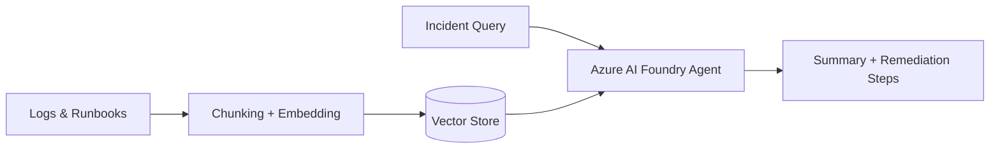

# Azure AI Foundry RAG-Grounded Ops Assistant

An AI agent that answers operational questions and summarizes incidents by grounding an LLM (via Azure AI Foundry) in real operational data — logs, runbooks, and alert history — instead of relying on the model's general knowledge alone.

> Sanitized reference implementation. Sample logs/runbooks included are synthetic — no real infrastructure or incident data.

## What this demonstrates

| Resume claim | Where it lives here |
|---|---|
| AI-powered ops/SOC assistant using Azure AI Foundry Agents | `azure-cognitive-rag-engine/agent/` |
| RAG grounding over logs and runbooks | `azure-cognitive-rag-engine/ingestion/` (chunking + embedding pipeline) |
| Incident summarization & remediation recommendations | `azure-cognitive-rag-engine/agent/prompts/` |
| Grounding over structured telemetry (Monitor/Sentinel-style logs) | `azure-cognitive-rag-engine/sample_data/` |

## Architecture



## How it works
1. **Ingestion** — operational runbooks and sample log data are chunked and embedded.
2. **Retrieval** — on an incident query, relevant log/runbook chunks are retrieved (RAG).
3. **Grounded generation** — the AI Foundry agent generates a summary and remediation suggestion using only retrieved context, reducing hallucination.

## Tech stack
`Python` · `Azure AI Foundry` · `Azure Cognitive Search (vector store)` · `Prompt engineering` · `RAG`

## Repository structure
```
.
└── azure-cognitive-rag-engine/
    ├── ingestion/        # Chunking + embedding pipeline for logs/runbooks
    ├── agent/
    │   ├── prompts/      # Grounded prompt templates
    │   └── agent.py      # Agent orchestration logic
    ├── sample_data/      # Synthetic logs & runbooks for demo purposes
    └── requirements.txt
```

## How to run
```bash
cd azure-cognitive-rag-engine
pip install -r requirements.txt
python ingestion/build_index.py       # embeds sample_data/
python agent/agent.py --query "Summarize the last pod crash incident"
```
> Requires an Azure AI Foundry endpoint + API key set as environment variables (see `.env.example`).

## What this doesn't include
Real production logs, Sentinel alerts, or SharePoint content — `sample_data/` contains synthetic examples that mirror the structure of real operational data without exposing it.

